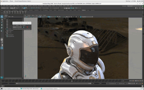
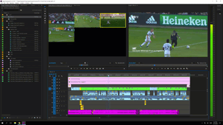
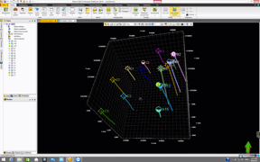
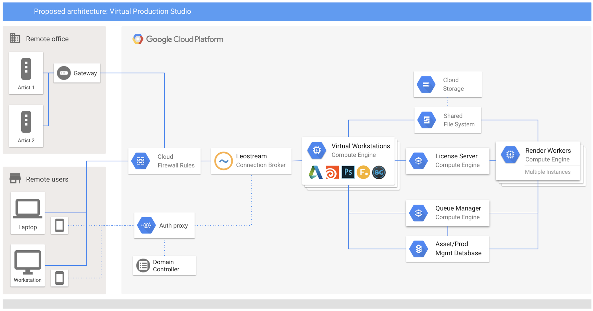

# Cloud Orchestrate

Orchestrate makes it easy to configure custom images, manage fleets of machines,
and deploy entire systems so that your team can get up-and-running doing
meaningful work from wherever you using the domain tools you need as quickly as
possible.

## Motivation

Google Cloud makes it possible to enable distributed teams to perform compute
intensive interactive workflows directly from virtual machines running in the
cloud with low-latency and high-peformance remote desktop protocols.

Across many industries, from animation, visual effects, broadcasting, and
architecture, to engineering, manufacturing, data visualization and beyond,
our users ultimately need the ability to log in to remote workstations and do
meaningful work with the tools and systems specific to their domains.

This is an example of what our end users need:





The machines our users need requrie domain-specific software, storage clusters,
caching systems, license servers, compute farms, databases, identity services,
connection brokers and more.

This is an example of a typical deployment for an animation studio in the cloud:



Unfortunately, deploying all this infrastructure in the cloud is not trivial
and requires a fair amount of technical knowledge.

Orchestrate addresses this need by providing simple interface that allows anyone
to deploy a complete architecture like the one illustrated above with a handful
of commands, quickly and easily.

## Goals

- Create a remote desktop preconfigured with useful domain-specific software in
  just the time it takes GCP to spin up the machine.
- Deploy a single machine, fleets or entire systems with ease.
- Provide a simplified experience on top of compute, storage, networking, and
  identity.

## 2-min Overview

The following commands will set up a project to enable a team of animators and
visual effects artists to work on virtual machines and work on the same data and
assets via a shared storage cluster.

1. Deploy project structure and storage cluster:

  ```sh
  orchestrate systems deploy virtual-studio filestore
  ```

2. Create image with open-source creative tools for animation and visual
effects:

  ```sh
  orchestrate images create visualeffects \
  --image-project=centos-cloud \
  --image-family=centos-7 \
  --packages=core,stackdriver,tools,nvidia,blender,djv
  ```

3. Create templates for predefined machine sizes:

  ```sh
  orchestrate templates create visualeffects \
  --image-family=visualeffects \
  --sizes=\
  name=small,cpus=4,memory=16:\
  name=medium,cpus=8,memory=32:\
  name=large,cpus=16,memory=48 \
  --default-size-name=medium
  ```

4. Create virtual machines:

  ```sh
  orchestrate instances create visualeffects --name=artist1
  orchestarte instances create visualeffects --size=large --name=artist2
  ```

With a handful of commands and a few minutes, a team can be up and running doing
meaningful interactive work on shared data in Google Cloud.

## Why and how it compares to other devops tools

TODO(lartola)

## What it is

Orchestrate is comprised of two main components: an API and a CLI.

Normally, the Orchestrate API is deployed in a project that acts as the
Orchestrating Project responsible for receiving requests from clients and
orchestrating the creation of resources in other projects.

The Orchestrate CLI is then used to send requests to the Orchestrate API to
create custom images, deploy virtual machines and systems in other projects.

## What you need

You will need two projects in GCP. One for the **Orchestrating Project** and the
other **Test Project** to deploy systems and machines using the Orchestrate CLI.

# Orchestrate API

Open a shell and install the gcloud SDK. We highly recommend using Cloud Shell.
You will be deploying the API to your **Orchestrating Project**. While not
strictly necessary, you may want to set the default project:

```sh
gcloud config set project your_orchestrating_project
```

## Set up local environment

It is highly recommended to create a Python virtual environment for the packages
needed to deploy various components.

```sh
mkvirtualenv -p `which python3` orchestrate
pip install \
  google \
  google-cloud \
  google-cloud-pubsub \
  google-cloud-error-reporting \
  google-api-python-client \
  grpcio \
  grpcio-tools \
  requests \
  oauth2client \
  setuptools_scm
```

Customize the project where you will be deploying the Orchestrate API
service. There are a handful of configuration files that reference
PLACEHOLDER_ORCHESTRATE_PROJECT. Use the included utility to quickly replace
this with the value of your project, e.g.:

```sh
./scripts/set_project.py your_orchestrating_project
```

## Set up orchestrating project

```sh
./project/enable_apis.sh
./project/create_buckets.sh
./project/create_roles.sh
./project/create_service_accounts.sh
./project/create_topics.sh
```

## Deploy API service

```sh
./api/bin/create_cluster.sh
```

## Deploy support scripts

```sh
./scripts/deploy.sh
```

## Deploy microservices

```sh
./services/deploy.sh ./services/image_provisioning_start
./services/deploy.sh ./services/image_provisioning_end
```

## Create restricted API Key

- Create an API key from the [Console > APIs & Services > Credentials](https://console.cloud.google.com/apis/credentials)
- Click on the Restrict Key button.
- In the API Restrictions section click on Restrict Key.
- Check Orchestrate API in the list.
- Click Save.

# Orchestrate CLI

Open a shell and install the gcloud SDK. We highly recommend using Cloud Shell.
You will be installing the CLI to your **Test Project**. While not strictly
necessary, you may want to set the default project:

```sh
gcloud config set project your_test_project
```

## Set up local environment

It is highly recommended to create a Python virtual environment for the packages
needed to deploy various components.

```sh
mkvirtualenv -p `which python3` orchestrate
pip install \
  google \
  google-cloud \
  google-cloud-pubsub \
  google-cloud-error-reporting \
  google-api-python-client \
  grpcio \
  grpcio-tools \
  requests \
  oauth2client \
  setuptools_scm
```

Customize the project where you will be deploying the Orchestrate API
service. There are a handful of configuration files that reference
PLACEHOLDER_ORCHESTRATE_PROJECT. Use the included utility to quickly replace
this with the value of your project, e.g.:

```sh
./scripts/set_project.py your_orchestrating_project
```

## Install the CLI

```sh
cd cli
./bin/compile_protos.sh
python setup.py develop
cd ..
```
## Verify that it is installed

```sh
which orchestrate
orchestrate projects register --help
```
## Register your project

```sh
orchestrate projects register
```


